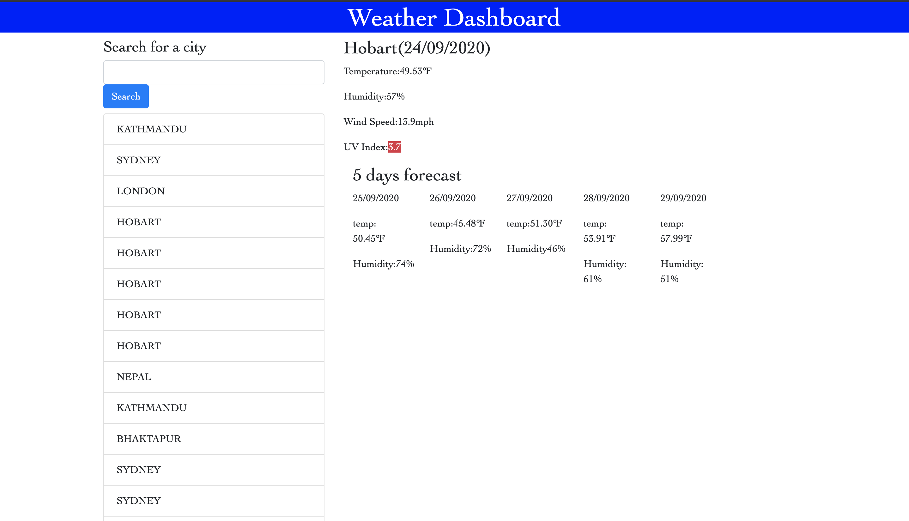

# Assignment6
# Title
Weather Dashboard

# Content
The app shows the weather of different search cities. This is build in vs code using html, css and jquery. Different libraries are used. This app is mainly using server side API. In this app we have used openweathermap Api to get the current weather and future forecast of weather of search city. We have done ajax call to get the information and also has use local storage to store the information.

# User story
As a traveller, the best thing to do is see the weather condition before we make any plan to visit the city such that we can make the most of it.

# Built with
The application is built using VS Code. The app is made using of html, css, javascript, jQuery and server side API library.
 
# Screenshot of app
;

# deployed link of app
(https://manneu.github.io/Assignment6/

# Contact
Manish Neupane
email: mrnish.are@gmail.com
phone: 0416508908

# Acknowledgments
Instructor
Teaching assistant 
classmates
